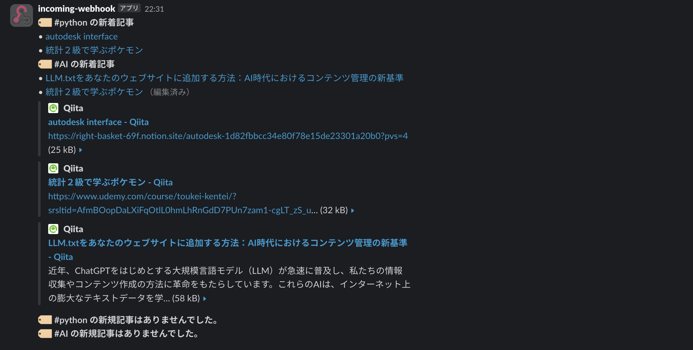

# Qiita記事をSlackに自動通知するPythonスクリプト

## 概要

Qiitaの特定タグの記事を毎朝自動で取得し、Slackに通知するPythonスクリプトです。  
通知済みのURLは記録し、重複通知を防ぎます。macOSのlaunchdを用いて、毎朝8時に自動実行されます。

---

## 📂 フォルダ構成

```bash
qiita_line_notify/
├── main.py
├── .env
├── .gitignore
├── requirements.txt
├── notified_urls.txt
├── venv/（仮想環境）
└── com.ryoma.qiita-notifier.plist（launchd用）
# plistは ~/Library/LaunchAgents/com.ryoma.qiita-notifier.plist
```

---

## 🛠 セットアップ手順

1. 仮想環境の作成（推奨）
```bash
python3 -m venv venv
source venv/bin/activate
```
2. 必要ライブラリのインストール
```bash
pip install requests python-dotenv
pip freeze > requirements.txt
```
3. .envファイルの作成
```env
SLACK_WEBHOOK_URL=（Slack Webhook URL）
```
4. .gitignore の設定
```bash
venv/
.env
__pycache__/
.DS_Store
```

---

## 🧠 実装内容（main.py）

- 複数タグ（例：python, AI）のQiita記事を取得
- 通知済みURLをnotified_urls.txtに保存し、重複通知を防止
- 記事がない場合でもSlackに「通知する記事はありません」と送信
- タグごとに記事をグループ化してSlackに投稿

---

## 💻 実行例

Slackに以下のようなメッセージが送信されます：
```less
:memo: Qiita新着記事（#python）
• [記事タイトル1](URL)
• [記事タイトル2](URL)

:memo: Qiita新着記事（#AI）
• [記事タイトル3](URL)

通知する記事はありませんでした。
```
### メッセージ例


---

## ⏰ 自動実行（macOSのlaunchdを使用）

1. .plistファイル作成
~/Library/LaunchAgents/com.ryoma.qiita-notifier.plist に以下を保存：
```xml
<?xml version="1.0" encoding="UTF-8"?>
<!DOCTYPE plist PUBLIC "-//Apple//DTD PLIST 1.0//EN"
 "http://www.apple.com/DTDs/PropertyList-1.0.dtd">
<plist version="1.0">
<dict>
    <key>Label</key>
    <string>com.ryoma.qiita-notifier</string>

    <key>ProgramArguments</key>
    <array>
        <string>/Users/ryomaueda/learning-log/qiita_line_notify/venv/bin/python3</string>
        <string>/Users/ryomaueda/learning-log/qiita_line_notify/main.py</string>
    </array>

    <key>WorkingDirectory</key>
    <string>/Users/ryomaueda/learning-log/qiita_line_notify</string>

    <key>StartCalendarInterval</key>
    <dict>
        <key>Hour</key>
        <integer>8</integer>
        <key>Minute</key>
        <integer>0</integer>
    </dict>

    <key>StandardOutPath</key>
    <string>/tmp/qiita_stdout.log</string>
    <key>StandardErrorPath</key>
    <string>/tmp/qiita_stderr.log</string>

    <key>RunAtLoad</key>
    <true/>
</dict>
</plist>
```

2. LaunchAgentに登録
```bash
launchctl load ~/Library/LaunchAgents/com.ryoma.qiita-notifier.plist
launchctl kickstart -k gui/$(id -u)/com.ryoma.qiita-notifier
```

3. トラブルシューティング
- .plistのパスやProgramArgumentsが間違っていると通知されません。
- 仮想環境のPythonパスが正しいか確認。
- .logファイルでエラー確認：
```bash
cat /tmp/qiita_stderr.log
cat /tmp/qiita_stdout.log
```

---

## 📌 今後の改善アイデア

- 通知対象の記事にフィルタ（いいね数、公開日など）を追加
- 通知形式を装飾（絵文字、リッチ表示など）
- GitHub Actionsなど他の自動化手段の導入

---

## 🙌 完成までにやったこと（時系列まとめ）

1. Slack通知のスクリプトを作成

2. .envでWebhook管理、仮想環境構築

3. .gitignore調整、pushエラー対応

4. Qiita APIから記事取得 → Slack通知

5. 通知済みURLの保存・重複除外機能追加

6. タグ複数対応、カテゴリ別通知表示

7. 通知なし時のメッセージ実装

8. launchdを用いた毎朝自動実行の設定

9. launchctlエラーや手動kickstartなど試行錯誤を経て、無事成功！

---

