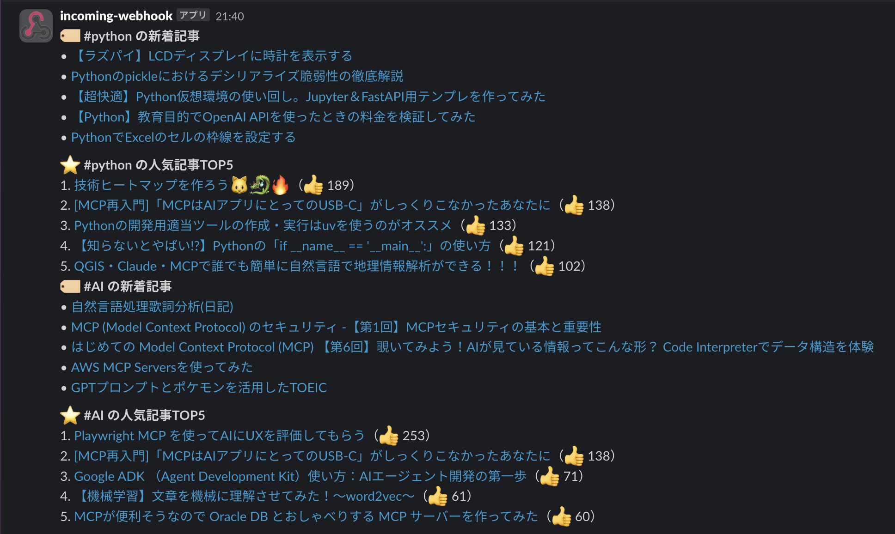

# Qiita記事をSlackに自動通知するPythonスクリプト

## 概要

Qiitaの特定タグの記事を毎朝自動で取得し、Slackに通知するPythonスクリプトです。  
通知済みのURLは記録し、重複通知を防ぎます。macOSのlaunchdを用いて、毎朝8時に自動実行されます。

---

## 📂 フォルダ構成

```bash
qiita_line_notify/
├── main.py
├── .env
├── .gitignore
├── requirements.txt
├── notified_urls.txt
├── venv/（仮想環境）
└── com.ryoma.qiita-notifier.plist（launchd用）
# plistは ~/Library/LaunchAgents/com.ryoma.qiita-notifier.plistに作成
```

---

## 🛠 セットアップ手順

1. 仮想環境の作成（推奨）
```bash
python3 -m venv venv
source venv/bin/activate
# ↑仮想環境に入るためのコマンド
deactivate
# ↑仮想環境から出るためのコマンド
```
2. 必要ライブラリのインストール
```bash
pip install requests python-dotenv
pip freeze > requirements.txt
```
3. .envファイルの作成
```env
SLACK_WEBHOOK_URL=（Slack Webhook URL）
```
4. .gitignore の設定
```bash
venv/
.env
__pycache__/
.DS_Store
```

---

## 🧠 実装内容（main.py）

- 複数タグ（例：python, AI）のQiita記事を取得
- 通知済みURLをnotified_urls.txtに保存し、重複通知を防止
- 記事がない場合でもSlackに「通知する記事はありません」と送信
- タグごとに記事をグループ化してSlackに投稿

---

## 💻 実行例

Slackに以下のようなメッセージが送信されます：
```less
:memo: Qiita新着記事（#python）
• [記事タイトル1](URL)
• [記事タイトル2](URL)

:memo: Qiita新着記事（#AI）
• [記事タイトル3](URL)

通知する記事はありませんでした。
```
### メッセージ例


---

## ⏰ 自動実行（macOSのlaunchdを使用）

1. .plistファイル作成
~/Library/LaunchAgents/com.ryoma.qiita-notifier.plist に以下を保存：
```xml
<?xml version="1.0" encoding="UTF-8"?>
<!DOCTYPE plist PUBLIC "-//Apple//DTD PLIST 1.0//EN"
 "http://www.apple.com/DTDs/PropertyList-1.0.dtd">
<plist version="1.0">
<dict>
    <key>Label</key>
    <string>com.ryoma.qiita-notifier</string>

    <key>ProgramArguments</key>
    <array>
        <string>/Users/username/learning-log/qiita_line_notify/venv/bin/python3</string>
        <string>/Users/username/learning-log/qiita_line_notify/main.py</string>
    </array>

    <key>WorkingDirectory</key>
    <string>/Users/username/learning-log/qiita_line_notify</string>

    <key>StartCalendarInterval</key>
    <dict>
        <key>Hour</key>
        <integer>8</integer>
        <key>Minute</key>
        <integer>0</integer>
    </dict>

    <key>StandardOutPath</key>
    <string>/tmp/qiita_stdout.log</string>
    <key>StandardErrorPath</key>
    <string>/tmp/qiita_stderr.log</string>

    <key>RunAtLoad</key>
    <true/>
</dict>
</plist>
```

2. LaunchAgentに登録
```bash
launchctl load ~/Library/LaunchAgents/com.ryoma.qiita-notifier.plist
launchctl kickstart -k gui/$(id -u)/com.ryoma.qiita-notifier
# ↑手動で自動実行を実行
```

3. トラブルシューティング
- .plistのパスやProgramArgumentsが間違っていると通知されません。
- 仮想環境のPythonパスが正しいか確認。
- .logファイルでエラー確認：
```bash
cat /tmp/qiita_stderr.log
cat /tmp/qiita_stdout.log
```

---

## 🔥 追加機能：人気記事の通知

### ✅ 概要
Qiitaの新着記事に加え、「いいね数が多い人気記事（過去記事含む）」もSlackに通知できるようになりました。   
より話題性の高い投稿をチームでキャッチアップしやすくなります。

### 🛠️ 実装内容
- Qiitaの検索APIを活用し、「指定タグ & いいね数10以上」の記事を取得。
- 取得した記事を likes_count の多い順にソートし、上位5件をSlack通知に含める。
- Slack通知では、人気記事を 1., 2., 3. のように 順位付きで表示。

### 使用API：
```bash
GET https://qiita.com/api/v2/items?query=tag:python stocks:>=10
```

### 表示イメージ（Slack）:
```less
:label: #python の新着記事
• タイトル1
• タイトル2

:star: #python の人気記事TOP5
1. タイトルA（👍 102）
2. タイトルB（👍 95）
...
```
### メッセージ例



### 💡 補足ポイント
- new_articles（最新投稿）と popular_articles（人気投稿）は 別々に通知。
- 通知済みURLの管理はこれまで通り：新着記事のみを対象に保存・重複排除。


---

## 🔥 追加機能：GitHub Actions による自動実行　（ローカル依存をなくす）

### ✅ 概要

このスクリプトは GitHub Actions により、毎日午後8時（JST）に自動実行されます。   
また、GitHub 上から手動実行することも可能です。

### 📂 フォルダ構成

```bash
leaning-log/  # リポジトリ
├── .github/workflows/
│   └── notify.yml  # GitHub Actionsの定義
└── qiita_line_notify/
    ├── main.py
    ├── .env
    └── requirements.txt
```

### ワークフロー設定（.github/workflows/notify.yml）

```yaml
name: Qiita Notify

on:
  schedule:
    - cron: "0 11 * * *" # JSTで20時（UTCで11時）
  workflow_dispatch: # 手動実行も可能にする

jobs:
  notify:
    runs-on: ubuntu-latest

    steps:
      - name: Checkout repository
        uses: actions/checkout@v3

      - name: Set up Python
        uses: actions/setup-python@v5
        with:
          python-version: '3.11'

      - name: Install dependencies
        run: |
          python -m pip install --upgrade pip
          pip install -r qiita_line_notify/requirements.txt

      - name: Run notification script
        env:
          SLACK_WEBHOOK_URL: ${{ secrets.SLACK_WEBHOOK_URL }}
        run: |
          python qiita_line_notify/main.py
```

### :closed_lock_with_key: Secrets 設定
- SLACK_WEBHOOK_URL は GitHub リポジトリの Settings > Secrets and variables > Actions にて設定します。

### :pushpin: 手動実行方法

1. GitHub のリポジトリにアクセス

2. 「Actions」タブを開く

3. 「Qiita Notify」ワークフローを選択

4. 「Run workflow」ボタンをクリックして実行

---

## ⏸️ 自動実行の一時停止・再開方法（launchd / GitHub Actions）
学習や検証を一時中断したい場合に、**再設定しやすい形で「一時停止・再開」**する方法をまとめています。

### 🖥 Macローカル：launchd の一時停止・再開方法
✅ 一時的に停止したいとき
```bash
launchctl unload ~/Library/LaunchAgents/com.ryoma.qiita-notifier.plist
```
🔄 再開したいとき
```bash
launchctl load ~/Library/LaunchAgents/com.ryoma.qiita-notifier.plist
```
💡 .plist ファイルを削除しなければ何度でも再開できます。   
🚫 完全に削除したいとき
```bash
launchctl unload ~/Library/LaunchAgents/com.ryoma.qiita-notifier.plist
rm ~/Library/LaunchAgents/com.ryoma.qiita-notifier.plist
```

### ☁️ GitHub Actions：定期実行（schedule）の一時停止・再開
✅ 一時的に停止したいとき   
.github/workflows/notify.yml の該当箇所をコメントアウトします。
```yaml
on:
  # schedule:
  #   - cron: "0 11 * * *" # JSTで毎日20時に実行（UTC11時）
  workflow_dispatch: # 手動実行は残す
```
🔄 再開したいとき   
コメントアウトを戻して再有効化：
```yaml
on:
  schedule:
    - cron: "0 11 * * *" # JSTで毎日20時に実行（UTC11時）
  workflow_dispatch: # 手動実行も可能
```
🚫 完全に無効にしたいとき   
.github/workflows/notify.yml を削除、または名前を変更（例：notify.yml.disabled）してください。

---

## 📌 今後の改善アイデア

- 通知対象の記事にフィルタ（いいね数、公開日など）を追加【済】
- 通知形式を装飾（絵文字、リッチ表示など）
- GitHub Actionsなど他の自動化手段の導入 【済】

---

## 🙌 完成までにやったこと（時系列まとめ）

1. Slack通知のスクリプトを作成

2. .envでWebhook管理、仮想環境構築

3. .gitignore調整、pushエラー対応

4. Qiita APIから記事取得 → Slack通知

5. 通知済みURLの保存・重複除外機能追加

6. タグ複数対応、カテゴリ別通知表示

7. 通知なし時のメッセージ実装

8. launchdを用いた毎朝自動実行の設定

9. launchctlエラーや手動kickstartなど試行錯誤を経て、無事成功！

---

