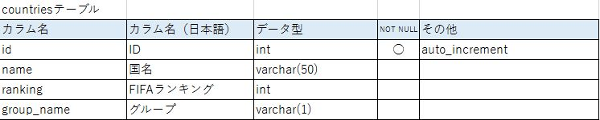
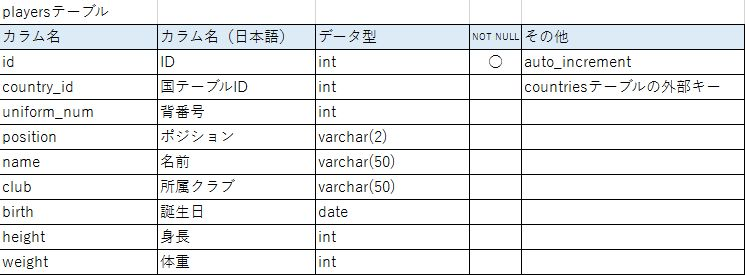
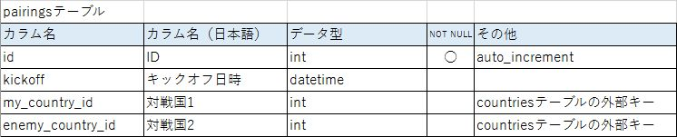
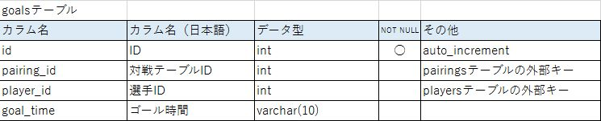

# SQL 学習ログ

このフォルダでは、XAMPP（MariaDB）を使った SQL の基礎学習内容を記録しています。  
ローカル環境でデータベースを作成し、クエリの練習やSQLファイルの管理を行います。

---

## ✅ 環境

- OS：macOS
- DBサーバー：XAMPP（MySQL/MariaDB）
- DBクライアント：ターミナル + VS Code（SQLTools拡張）
- 使用DB名：`worldcup2014`、`study_sql`（← 自分で作成）

---

## 🏁 DBサーバー起動（XAMPP）

1. XAMPP を起動
2. 「MySQL（またはMariaDB）」を **Start**

---

## 💻 ターミナルからMariaDBに接続

```bash
cd /Applications/XAMPP/xamppfiles/bin
./mysql -u root
#パスワードが必要な場合は：
./mysql -u root -p
```

---

## 🛠️ 新しいデータベースの作成手順

```sql
CREATE DATABASE study_sql;
USE study_sql;
```

※ study_sql の部分は任意のDB名に変更OK

## 📦 SQLファイルのインポート方法

例：worldcup2014.sql をインポートする
```bash
cd /Applications/XAMPP/xamppfiles/bin
./mysql -u root study_sql < /path/to/worldcup2014.sql
```

## 🧠 VS Code からクエリ実行（SQLTools）

### 拡張機能をインストール
- SQLTools
- SQLTools MySQL/MariaDB Driver

### 接続設定
SQLTools: Add New Connection で以下を入力：
- Name：XAMPP-Local
- Driver：MySQL/MariaDB
- Server/Host：localhost
- Port：3306
- Username：root
- Password：（空でOK、設定している場合は入力）
- Database：study_sql

## 📁 フォルダ構成例
```
learning-log/
└── sql/
    ├── worldcup2014.sql         # インポート用SQLファイル
    ├── study_sql_init.sql       # DB初期化スクリプト
    ├── query_practice.sql       # SELECT文の練習など
    └── README.md                # ← このファイル！
```

## ✍ 備考
git add . && git commit -m "コメント" && git push で学習内容をGitHubに反映  
新しい .sql ファイルや README.md を追加した場合も忘れず add → commit → push

## worldcup2014テーブル定義

### 📊 countriesテーブル



### 📊 playersテーブル



### 📊 pairingsテーブル



### 📊 goalsテーブル


